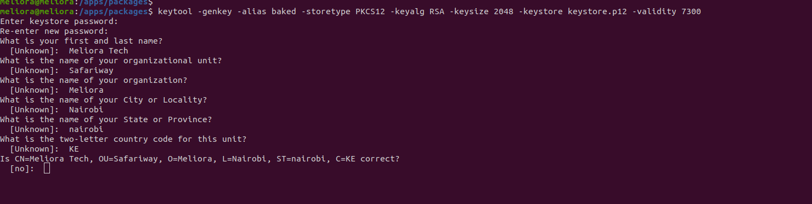

# Spring Enable SSL (for prod)

## Create the keystore
``` bash
$ keytool -genkey -alias baked -storetype PKCS12 -keyalg RSA -keysize 2048 -keystore keystore.p12 -validity 7300
```
Note: Validity (Days)



_This Creates a keystore.p12 in the directory it was run_

``` bash
$ cp keystore.p12 target_folder
```

Set up the configrations
```yml
server:
    port: 8443
    ssl:
         key-store: keystore.p12
         key-store-password: password-entered -above
         key-store-type: PKCS12
         key-alias: alias-used-above
         # The ciphers suite enforce the security by deactivating some old and deprecated SSL cipher, this list was tested against SSL Labs (https://www.ssllabs.com/ssltest/)
         ciphers: TLS_ECDHE_RSA_WITH_AES_128_CBC_SHA,TLS_ECDHE_RSA_WITH_AES_256_CBC_SHA,TLS_ECDHE_RSA_WITH_AES_128_GCM_SHA256,TLS_ECDHE_RSA_WITH_AES_256_GCM_SHA384 ,TLS_DHE_RSA_WITH_AES_128_GCM_SHA256 ,TLS_DHE_RSA_WITH_AES_256_GCM_SHA384 ,TLS_ECDHE_RSA_WITH_AES_128_CBC_SHA256,TLS_ECDHE_RSA_WITH_AES_256_CBC_SHA384,TLS_DHE_RSA_WITH_AES_128_CBC_SHA256,TLS_DHE_RSA_WITH_AES_128_CBC_SHA,TLS_DHE_RSA_WITH_AES_256_CBC_SHA256,TLS_DHE_RSA_WITH_AES_256_CBC_SHA,TLS_RSA_WITH_AES_128_GCM_SHA256,TLS_RSA_WITH_AES_256_GCM_SHA384,TLS_RSA_WITH_AES_128_CBC_SHA256,TLS_RSA_WITH_AES_256_CBC_SHA256,TLS_RSA_WITH_AES_128_CBC_SHA,TLS_RSA_WITH_AES_256_CBC_SHA,TLS_DHE_RSA_WITH_CAMELLIA_256_CBC_SHA,TLS_RSA_WITH_CAMELLIA_256_CBC_SHA,TLS_DHE_RSA_WITH_CAMELLIA_128_CBC_SHA,TLS_RSA_WITH_CAMELLIA_128_CBC_SHA

```