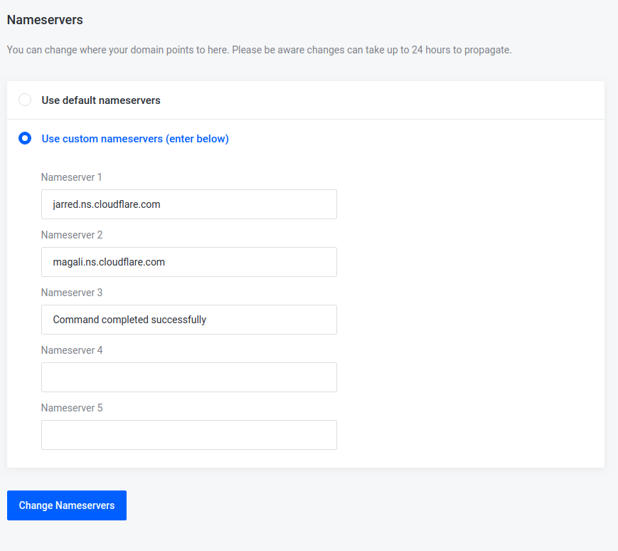

# Headers

# H1

## H2

### H3

#### H4

##### H5

###### H6

Alt Header
=

Alt-h2
-

**Asterisk**: Use *asterisks* or use _underscore_

**Bold**: **Double Asterisk** or __double underscore__

**Bold asterisk**: **_asterisk and underscores_**

**Strikethrough**: ~~use double tildes~~

# Lists

1. Ordered List item
3. Second ordered item (Irrespective of number assigned)
* Unordered sub-list. 
1. Another item
* Unordered list

# Blockquote

> block quote

 `code`

> Horizontal Rule

---

> Link

[frisha](www.firsha.co.ke)



# More syntax

| TH1 | TH2 |
| -- | -- |
| 1, 1 | 1, 2 |
| 2, 1 | 2, 2 |

# Fenced Code Block

``` json
{
    "name":"Peter Mutisya",
    "email":"pmutisya@meliora.tech",
    "age":26
}
```

[^1]: Footnote
Here's a simple footnote,[^1] and here's a longer one. [^bignote]

[^1]: This is the first footnote.

### My Great Heading {#custom-id}


term
: definition


# Tasklist
- [x] Task 1
- [ ] Task 2

\*Literal asterisks\*


1. Item 1
2. Item 2
3. Item 3
    * Item 3a
3. Item 3
    * Item 3b

GitHub supports emoji!