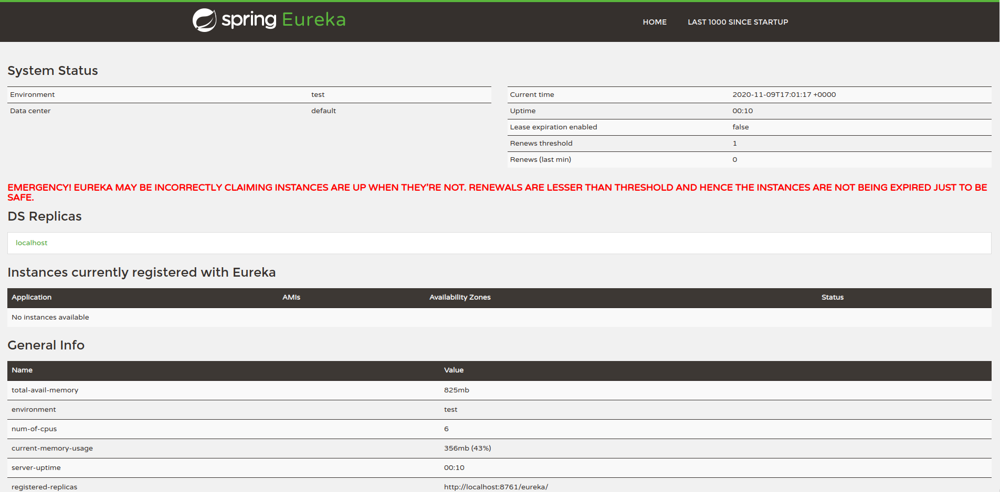

* Start 3 common registries: (.87)

``` bash
$ docker run -p 8860:8762 melioratech/cregistry

$ docker run -p 8861:8762 melioratech/cregistry

$ docker run -p 8862:8762 melioratech/cregistry
```

* Create nginx load balancer config

``` bash
$ cat > /apps/nginx-2.conf

user  nginx;
worker_processes  1;

error_log  /var/log/nginx/error.log warn;
pid        /var/run/nginx.pid;

events {
    worker_connections  1024;
}

http {
    upstream cregistry {
        server 51.15.233.87:8860;
        server 51.15.233.87:8861;
        server 51.15.233.87:8862;
    }
    
    server {
        location / {
            proxy_pass http://cregistry;
        }
    }
}
```

*  Run Nginx

``` 

$ docker run -p 8002:80 -v /apps/nginx-2.conf:/etc/nginx/nginx.conf nginx
```

* Open localhost:8002:



> Verdict: Works, Simple

## More...

---

### Load Balancing Methods

* **Round Robin:** Default method. Even distribution. Takes into consideration server weights. Used above

* **Least Connections:** Most idle server (least connections) is used. Weights considered.

``` 

upstream backend {
    least_conn;
    server 51.15.233.87:8860;
    server 51.15.233.87:8861;
}
```

* **IP Hash:** Client source IP determines the destination (server). Hash value is calculates using either:
    - First 3 octets of IPv4 address
    - Whole IPv6 address

It guarantees that requests from the same client are served by the same server.
If one of the servers needs to be temporarily removed from cluster, it can be marked as down, in order to preserve the current hashing of client addresses.

``` 

upstream backend {
    least_conn;
    server 51.15.233.87:8860;
    server 51.15.233.87:8861 down;
}
```

* **Generic Hash:** Server is determined from a user defined key (text string plus/or variable)

``` 
upstream backend {
    hash $request_uri consistent;
    server backend1.example.com;
    server backend2.example.com;
}
```

* **Least Time: (NGINX+ Only)**: The quickest responder gets the most requests. This is based on:
    - header: Time to receive first byte from server
    - last_byte: Time to receive full response from server.
    - last_byte inflight: Time to get full response from server, taking into account incomplete requests.
* **Random:**: Server is randomly selected for each request.
